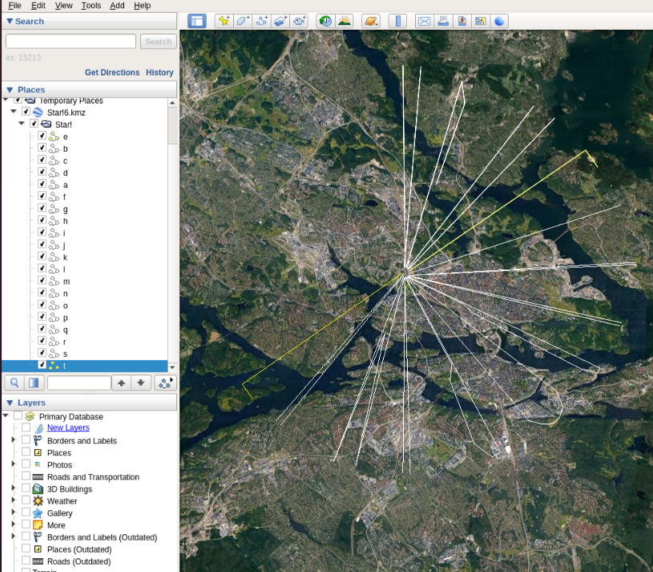
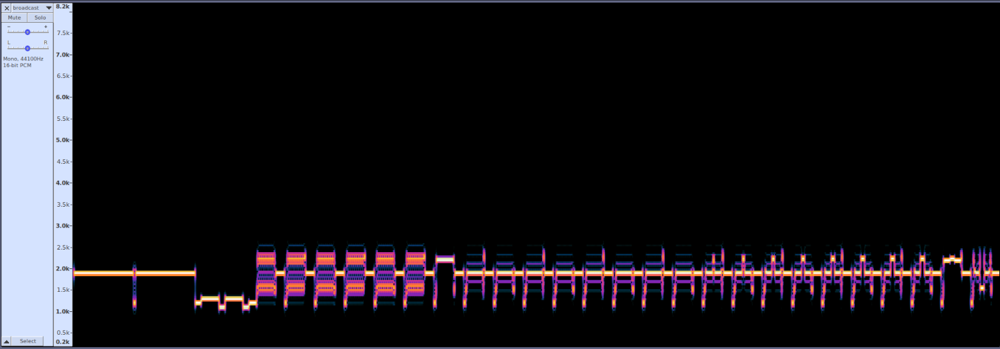
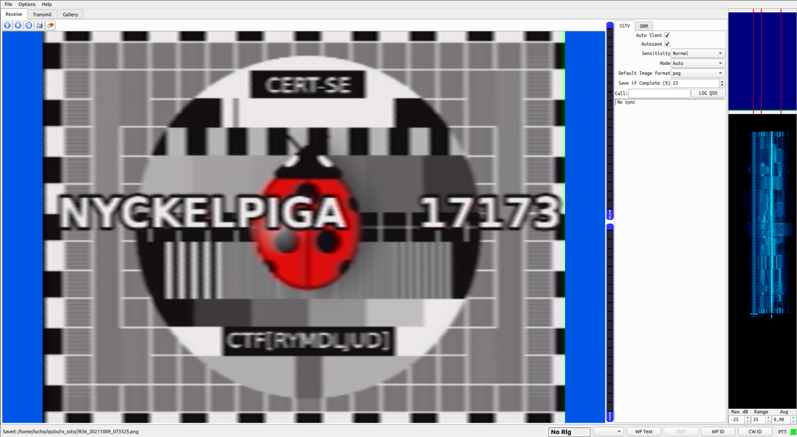

# CERT-SE CTF 2021 write-up
Official CTF URL: https://cert.se/2021/09/cert-se-ctf2021

## welcome flag
Open CERT-SE_CTF2021.pcap file with [Wireshark](https://www.wireshark.org/) then _Ctrl+F_ search by String "CTF", results in the following HTTP request:
```
20001	290.469154	192.168.122.156	192.168.122.129	HTTP	414	GET /CTF[bra_start] HTTP/1.1 
```

Or with tshark:
```
$ tshark -r CERT-SE_CTF2021.pcap -Y 'frame contains "CTF"' -T text
20001 290.469154 192.168.122.156 → 192.168.122.129 38726 80 HTTP 414 GET /CTF[bra_start] HTTP/1.1 
20008 290.719400 192.168.122.156 → 192.168.122.129 38726 80 HTTP 369 GET /favicon.ico HTTP/1.1
```

**flag:** CTF[bra_start]

## memdump4.7z
> PRIVMSG #Priv-IRC :Ok, sending the dump now.

In the IRC chatlog we can see the hackers sending each others a "dump" file, if we filter the traffic with the protocol display filter "ftp-data" we see two files sent `broadcast.7z` and `memdump4.7z`.

Extracted the file by clicking a frame of the `memdump4.7z` transfer, _Right Click -> Follow -> TCP stream_, select _"Show and save data as"->Raw_ and save it. 

`tcpflow` or `binwalk` can be used for this too.

Extract the file and start checking stuff:
```
$ readelf -a memdump4.dmp
ELF Header:
  Magic:   7f 45 4c 46 02 01 01 00 00 00 00 00 00 00 00 00 
  Class:                             ELF64
  Data:                              2's complement, little endian
  Version:                           1 (current)
  OS/ABI:                            UNIX - System V
  ABI Version:                       0
  Type:                              CORE (Core file)
  Machine:                           Advanced Micro Devices X86-64
  Version:                           0x1
  Entry point address:               0x0
  Start of program headers:          64 (bytes into file)
  Start of section headers:          0 (bytes into file)
  Flags:                             0x0
  Size of this header:               64 (bytes)
  Size of program headers:           56 (bytes)
  Number of program headers:         7
  Size of section headers:           0 (bytes)
  Number of section headers:         0
  Section header string table index: 0

There are no sections in this file.

There are no sections to group in this file.

Program Headers:
  Type           Offset             VirtAddr           PhysAddr
                 FileSiz            MemSiz              Flags  Align
  NOTE           0x00000000000001c8 0x0000000000000000 0x0000000000000000
                 0x0000000000000330 0x0000000000000330         0x0
  LOAD           0x00000000000004f8 0x0000000000000000 0x0000000000000000
                 0x00000000000a0000 0x00000000000a0000         0x0
  LOAD           0x00000000000a04f8 0x00000000000c0000 0x00000000000c0000
                 0x000000000ff40000 0x000000000ff40000         0x0
  LOAD           0x000000000ffe04f8 0x00000000f4000000 0x00000000f4000000
                 0x0000000004000000 0x0000000004000000         0x0
  LOAD           0x0000000013fe04f8 0x00000000f8000000 0x00000000f8000000
                 0x0000000004000000 0x0000000004000000         0x0
  LOAD           0x0000000017fe04f8 0x00000000fce14000 0x00000000fce14000
                 0x0000000000002000 0x0000000000002000         0x0
  LOAD           0x0000000017fe24f8 0x00000000fffc0000 0x00000000fffc0000
                 0x0000000000040000 0x0000000000040000         0x0

There is no dynamic section in this file.

There are no relocations in this file.

The decoding of unwind sections for machine type Advanced Micro Devices X86-64 is not currently supported.

Dynamic symbol information is not available for displaying symbols.

No version information found in this file.

Displaying notes found at file offset 0x000001c8 with length 0x00000330:
  Owner                Data size 	Description
  CORE                 0x00000150	NT_PRSTATUS (prstatus structure)
  QEMU                 0x000001b8	Unknown note type: (0x00000000)
   description data: 01 00 00 00 b8 01 00 00 50 09 61 96 ff ff ff ff 00 15 c1 96 ff ff ff ff 00 00 00 00 00 00 00 00 00 00 00 00 00 00 00 00 00 00 00 00 00 00 00 00 00 00 00 00 00 00 00 00 f0 3e c0 96 ff ff ff ff 00 00 00 00 00 00 00 00 00 00 00 00 00 00 00 01 00 00 00 00 00 00 00 00 00 00 00 00 00 00 00 00 d0 91 c1 4f 98 9c ff ff 80 8c d1 96 ff ff ff ff 00 00 00 00 00 00 00 00 00 00 00 00 00 00 00 00 00 15 c1 96 ff ff ff ff 22 0c 61 96 ff ff ff ff 46 02 00 00 00 00 00 00 10 00 00 00 ff ff ff ff 00 9b a0 00 00 00 00 00 00 00 00 00 00 00 00 00 00 00 00 00 ff ff ff ff 00 00 c0 00 00 00 00 00 00 00 00 00 00 00 00 00 00 00 00 00 ff ff ff ff 00 00 c0 00 00 00 00 00 00 00 00 00 00 00 00 00 00 00 00 00 ff ff ff ff 00 00 c0 00 00 00 00 00 00 00 00 00 00 00 00 00 00 00 00 00 ff ff ff ff 00 00 c0 00 00 00 00 00 00 00 c0 4f 98 9c ff ff 18 00 00 00 ff ff ff ff 00 93 c0 00 00 00 00 00 00 00 00 00 00 00 00 00 00 00 00 00 ff ff ff ff 00 00 c0 00 00 00 00 00 00 00 00 00 00 00 00 00 40 00 00 00 87 20 00 00 00 8b 00 00 00 00 00 00 c0 48 c0 4f 98 9c ff ff 00 00 00 00 7f 00 00 00 00 00 00 00 00 00 00 00 00 c0 c0 4f 98 9c ff ff 00 00 00 00 ff 0f 00 00 00 00 00 00 00 00 00 00 00 c0 57 ff ff ff ff ff 33 00 05 80 00 00 00 00 00 00 00 00 00 00 00 00 28 c0 ef 00 00 00 00 00 00 c0 4c 0a 00 00 00 00 70 06 36 00 00 00 00 00 00 00 00 00 00 00 00 00 
```

Low-hanging fruit check:
```
$ strings memdump4.dmp |grep CTF
nCTF
nCTF
nCTF
cd CTF2021
cd CTF2021
cd CTF2021
PWD=/media/isb/CTF2021
root@dumpen:/media/isb/CTF2021# 
EXACTF_invlist
EXACTF
EXACTFL
EXACTFU
EXACTFA
EXACTFU_SS
EXACTFLU8
EXACTFA_NO_TRIE
CTF-420 [Volito2]
CTF-220 [BizTablet]
CTF-221 [PenPartner2]
CTF-430 [Bamboo One]
C300-CTFDDAC128MAG
CTFY
C300-CTFDDAC128MAG
C300-CTFDDAC128MAG
CTFY
CTFY\/
CTFY\/
```
Besides a promising `/media/isb/CTF2021` directory, no flags.

We need to load the core dump with [volatility](https://github.com/volatilityfoundation/volatility), for that we need the correct profile that matches that kernel.
```
$ strings memdump4.dmp | grep -i 'Linux version' | uniq
Aug  3 12:20:34 dumpen kernel: [    0.000000] Linux version 4.9.0-6-amd64 (debian-kernel@lists.debian.org) (gcc version 6.3.0 20170516 (Debian 6.3.0-18+deb9u1) ) #1 SMP Debian 4.9.82-1+deb9u3 (2018-03-02)
SWIMS: Linux Version: %04X
Linux version 4.9.0-6-amd64 (debian-kernel@lists.debian.org) (gcc version 6.3.0 20170516 (Debian 6.3.0-18+deb9u1) ) #1 SMP Debian 4.9.82-1+deb9u3 (2018-03-02)
MESSAGE=Linux version 4.9.0-6-amd64 (debian-kernel@lists.debian.org) (gcc version 6.3.0 20170516 (Debian 6.3.0-18+deb9u1) ) #1 SMP Debian 4.9.82-1+deb9u3 (2018-03-02)
```

We can get premade volatility profiles from this repo. Checked with [Debian40r9.zip](https://github.com/volatilityfoundation/profiles/blob/master/Linux/Debian/x64/Debian40r9.zip) but it did not work, instead [Debian94.zip](https://github.com/volatilityfoundation/profiles/blob/master/Linux/Debian/x64/Debian94.zip) worked like a charm.

You can also build your custom linux profiles following [this guide](https://github.com/volatilityfoundation/volatility/wiki/Linux#creating-a-new-profile).

Check the new profile was added:
```
$ python2.7 ~/tools/volatility/vol.py ./vol.py --info|grep Debian
Volatility Foundation Volatility Framework 2.6.1
LinuxDebian40r9x64    - A Profile for Linux Debian40r9 x64
LinuxDebian94x64      - A Profile for Linux Debian94 x64
```

List of volatility commands available for linux images: 
* https://github.com/volatilityfoundation/volatility/wiki/Linux-Command-Reference

Let's start with `linux_bash`:
```
$ python2.7 ~/tools/volatility/vol.py ./vol.py --profile=LinuxDebian94x64 -f memdump4.dmp linux_bash
Volatility Foundation Volatility Framework 2.6.1
Pid      Name                 Command Time                   Command
-------- -------------------- ------------------------------ -------
     403 bash                 2021-08-03 10:20:47 UTC+0000   ls
     403 bash                 2021-08-03 10:20:59 UTC+0000   ./SuperSecretLogonTool 
```
`./SuperSecretLogonTool` sounds interesting.

Enumerate cached files:
```
$ python2.7 ~/tools/volatility/vol.py ./vol.py --profile=LinuxDebian94x64 -f memdump4.dmp linux_enumerate_files
Inode Address Inode Number              Path
[...]
0xffff9c984e99e718                       125 /home/user/SuperSecretLogonTool
```
Extract the file:
```
$ python2.7 ~/tools/volatility/vol.py ./vol.py --profile=LinuxDebian94x64 -f memdump4.dmp linux_find_file -i 0xffff9c984e99e718 -O SuperSecretLogonTool
$ file SuperSecretLogonTool 
SuperSecretLogonTool: ELF 64-bit LSB executable, x86-64, version 1 (SYSV), dynamically linked, interpreter /lib64/ld-linux-x86-64.so.2, BuildID[sha1]=a66af7090425550ece1a313d3fb2ffea2744f836, for GNU/Linux 3.2.0, not stripped
$ ./SuperSecretLogonTool 

      ,@@@@@@(    &&&&&&&&&&    %%%%%%%,     &&&&&&&&&&&&&(                 %@@@@@@,    @@@@@@@@@@@ 
   @@@*       %   @@            @@      @@&       *@@                     @@*      .    @@/         
 /@@              @@            @@       @@       *@@                     @@            @@/         
 @@               @@,,,,,,,,    @@     /@@,       *@@                      (@@@@/       @@&%%%%%%%  
 @@               @@            @@##%@@@(         *@@                           (@@@.   @@/         
 @@&              @@            @@      @@        *@@                              @@   @@/         
  #@@*            @@            @@       @@       *@@    ,,,,,,,,,,,,,,   @       @@@   @@/         
     %@@@@@@@@/   @@@@@@@@@@,   @@        @@,     *@@    ,,,,,,,,,,,,,,    %@@@@@@(     @@@@@@@@@@@ 
                                                         ,,,,,,,,,,,,,,                             
 ........................................................,,,,,,,,,,,,,,............................ 
                                                         ,,,,,,,,,,,,.                              
                                                            ,,,,,,,,                                
                                                               .,                                   

Ange lösenord: 
```
> _Ange lösenord = Enter password_

Low-hanging fruit vol. 2:
```
$ strings SuperSecretLogonTool 
/lib64/ld-linux-x86-64.so.2
libc.so.6
gets
strncpy
puts
putchar
printf
strcmp
__libc_start_main
GLIBC_2.2.5
__gmon_start__
H=X@@
ABCDEFGHH
IJKLMNOPH
QRSTUVWXH
YZ012345H
6789!@-+H
_[]=f
[]A\A]A^A_
Bra gjort! H
r kommer flaggan: 
      ,@@@@@@(    &&&&&&&&&&    %%%%%%%,     &&&&&&&&&&&&&(                 %@@@@@@,    @@@@@@@@@@@ 
   @@@*       %   @@            @@      @@&       *@@                     @@*      .    @@/         
 /@@              @@            @@       @@       *@@                     @@            @@/         
 @@               @@,,,,,,,,    @@     /@@,       *@@                      (@@@@/       @@&%%%%%%%  
 @@               @@            @@##%@@@(         *@@                           (@@@.   @@/         
 @@&              @@            @@      @@        *@@                              @@   @@/         
  #@@*            @@            @@       @@       *@@
[33m    ,,,,,,,,,,,,,,
[0m   @       @@@   @@/         
     %@@@@@@@@/   @@@@@@@@@@,   @@        @@,     *@@
[33m    ,,,,,,,,,,,,,,
[0m    %@@@@@@(     @@@@@@@@@@@ 
[33m                                                         ,,,,,,,,,,,,,,                             
 ........................................................,,,,,,,,,,,,,,............................ 
                                                         ,,,,,,,,,,,,.                              
                                                            ,,,,,,,,                                
                                                               .,
[0m                                   
Ange l
senord: 
h3mlig!
Du fann v
rt hemliga l
senord. Men var 
r flaggan?
[31mFel!
:*3$"
GCC: (Ubuntu 9.3.0-17ubuntu1~20.04) 9.3.0
crtstuff.c
deregister_tm_clones
__do_global_dtors_aux
completed.8060
__do_global_dtors_aux_fini_array_entry
frame_dummy
__frame_dummy_init_array_entry
ctf.c
__FRAME_END__
__init_array_end
_DYNAMIC
__init_array_start
__GNU_EH_FRAME_HDR
_GLOBAL_OFFSET_TABLE_
__libc_csu_fini
putchar@@GLIBC_2.2.5
strncpy@@GLIBC_2.2.5
puts@@GLIBC_2.2.5
_edata
printf@@GLIBC_2.2.5
__libc_start_main@@GLIBC_2.2.5
print_cert_se
__data_start
strcmp@@GLIBC_2.2.5
__gmon_start__
__dso_handle
_IO_stdin_used
gets@@GLIBC_2.2.5
__libc_csu_init
_dl_relocate_static_pie
__bss_start
main
print_flag
__TMC_END__
.symtab
.strtab
.shstrtab
.interp
.note.gnu.property
.note.gnu.build-id
.note.ABI-tag
.gnu.hash
.dynsym
.dynstr
.gnu.version
.gnu.version_r
.rela.dyn
.rela.plt
.init
.plt.sec
.text
.fini
.rodata
.eh_frame_hdr
.eh_frame
.init_array
.fini_array
.dynamic
.got
.got.plt
.data
.bss
.comment
```

Test **h3mlig!** as password and you get:
```
Du fann vårt hemliga lösenord. Men var är flaggan?
```
> _You found our secret password. But where is the flag?_

Time to bring out the big guns:
```
$ gdb SuperSecretLogonTool 
(gdb) info functions
All defined functions:

Non-debugging symbols:
0x0000000000401000  _init
0x0000000000401090  putchar@plt
0x00000000004010a0  strncpy@plt
0x00000000004010b0  puts@plt
0x00000000004010c0  printf@plt
0x00000000004010d0  strcmp@plt
0x00000000004010e0  gets@plt
0x00000000004010f0  _start
0x0000000000401120  _dl_relocate_static_pie
0x0000000000401130  deregister_tm_clones
0x0000000000401160  register_tm_clones
0x00000000004011a0  __do_global_dtors_aux
0x00000000004011d0  frame_dummy
0x00000000004011d6  print_flag
0x000000000040143e  print_cert_se
0x00000000004014e5  main
0x0000000000401570  __libc_csu_init
0x00000000004015e0  __libc_csu_fini
0x00000000004015e8  _fini
```

Let's call the `print_flag` function, you can directly call a function without parameters after `gdb` is attached and running like this: `(void) func_name ()`
```
(gdb) break _start
(gdb) run
(gdb) call (void) print_flag ()
Bra gjort! Här kommer flaggan: CTF[Stackars_Myrstack]
```
> _Well done! Here comes the flag: CTF[Stackars_Myrstack]_

**flag:** CTF[Stackars_Myrstack]

## broadcast.7z
Following the same Wireshark file extraction steps as before, we save the `broadcast.7z` file that was transfered via FTP.

Inside the `7z` archive there are two files password protected:
* `./Zipper/.secret/!/broadcast.wav`
* `./Zipper/.secret/-/flag.txt`

### Zipper
Uncompressing the other files results in this directory structure:
```
$ tree 
.
└── Zipper
    ├── 0
    │   └── 3
    ├── 4
    │   └── 6
    ├── 5
    │   └── 11
    ├── c
    │   └── 1
    ├── D
    │   └── 7
    ├── h
    │   └── 2
    ├── j
    │   └── 10
    ├── k
    │   └── 4
    ├── l
    │   └── 5
    ├── m
    │   └── 8
    └── o
        └── 9
```

The directory name corresponds to a password char and file inside it the index, this results in the following password, example `password[3] = 0`, by following the same principle we get this password: **ch0kl4Dmoj5**

Extracting flag.txt we get:

**flag:** ctf[skulle_skippat_linbanan]

## Star!6.kmz
> PRIVMSG #Priv-IRC :By the way, can I you have the star-file?
> 
> :Hejarn!user@192.168.122.251 PRIVMSG #Priv-IRC :Sure, sending it to you now...
>
> DCC SEND Star!6.kmz 199 0 2363 106

The file is a Google Earth project file:


The polylines seem have a transformation to revolve around the "Tomteboda Postterminal".

By reading the polylines we get this: `XGU[IVHRORVMH]`

But we know flags must have the following format: `CTF[xxxxxxxxxxxx]`.

Tried XOR, many substitutions, ROT13, etc, without luck. 
Then realized that the index of the letters were in reverse order:

```
01 02 03 04 05 06 07 07 08 09 10 11 12 13 14 15 16 17 18 19 20 21 22 23 24 25 
 A  B  C  D  E  F  G  H  I  J  K  L  M  N  O  P  Q  R  S  T  U  V  W  X  Y  Z
 |  |  |  |  |  |  T  |  |  |  |  |  |  |  |  |  |  |  |  |  F  |  |  C  |  |
 Z  Y  X  W  V  U  T  S  R  Q  P  O  N  M  L  K  J  I  H  G  F  E  D  C  B  A
```

**flag**: CTF[RESILIENS]

Later found this particular substitution is called _Atbash cipher_.

> Atbash (Hebrew: אתבש‎; also transliterated Atbaš) is a monoalphabetic substitution cipher originally used to encrypt the Hebrew alphabet.
> 
_from [wikipedia](https://en.wikipedia.org/wiki/Atbash)_.

_Star!6.kmz_, 6 pointed Star of David, it all add's up.


### broadcast.wav
Running some quick checks:
```
$ file broadcast.wav 
broadcast.wav: RIFF (little-endian) data, WAVE audio, Microsoft PCM, 16 bit, mono 44100 Hz
$ exiftool broadcast.wav 
ExifTool Version Number         : 11.88
File Name                       : broadcast.wav
Directory                       : .
File Size                       : 3.1 MB
File Modification Date/Time     : 2021:05:11 13:07:28+02:00
File Access Date/Time           : 2021:10:05 10:51:14+02:00
File Inode Change Date/Time     : 2021:10:05 10:51:08+02:00
File Permissions                : rw-r--r--
File Type                       : WAV
File Type Extension             : wav
MIME Type                       : audio/x-wav
Encoding                        : Microsoft PCM
Num Channels                    : 1
Sample Rate                     : 44100
Avg Bytes Per Sec               : 88200
Bits Per Sample                 : 16
Duration                        : 0:00:37
```

_Pro tip: do not open it with headphones and loud volume (:_

A bounch of chirps, seems to be some sort of modulated signal.

By looking the spectrogram in Audacity, seems to be a frequency modulated signal.



* Tried [minimodem](https://github.com/kamalmostafa/minimodem) with a whole lot of different parameters and it was a dead-end.
* Tested if it was a [BWF](https://en.wikipedia.org/wiki/Broadcast_Wave_Format) with [BWFMetaEdit](https://github.com/MediaArea/BWFMetaEdit), nothing.
* Tried some stuff with [Universal Radio Hacker](https://github.com/jopohl/urh) (great tool), nothing.
* Some [GNURadio](https://www.gnuradio.org/) nonsense, nothing.
* Coded a small python script to check LSB, stego, and a **LOT** of other stuff, nothing.

The signal clearly showed some kind of packet structure, a header and trailer of 220 0's. Some fixed recurring blocks of 440, 146 sizes separated by 0 values, but couldn't crack what it was. 
I was already few hours into it and overkilling it.


Went back to the idea that it was a straightforward protocol decode challenge.
Listened one by one the raw signals and compared the spectrograms in [Signal Identification Wiki](https://www.sigidwiki.com/wiki/Database), by no means I would recommend this to anyone, but it showed a close match: [Slow-scan television](https://www.sigidwiki.com/wiki/Slow-Scan_Television_(SSTV)).

To decode the signal I used [QSSTV](https://github.com/xdsopl/qsstv), in Ubuntu 20.04 I had to install a few more packages than the ones listed in the [install guide](http://users.telenet.be/on4qz/qsstv/manual/installation.html).

```
sudo apt install libopenjp2-7-dev qt5-default libasound2-dev libfftw3-dev libpulse-dev libv4l-dev
```

Create a virtual sink to pipe the audio to QSSTV:
```
pactl load-module module-null-sink sink_name=virtual-cable
```

Open QSSTV and make sure that in _Options -> Configuration -> Sound_, `PulseAudio` is selected as Audio Interface.

In the SSTV tab check Auto-Slant, click in the Play button to start decoding and play the wav file with this command:
```
paplay -d virtual-cable broadcast.wav
```

> Note: You may need to adjust some audio settings with `pavucontrol` to route the audio correctly to QSSTV.

Sparked some PAL broadcast TV childhood memories.


> PRIVMSG #Priv-IRC :Ok, but no more slipups! Nyckelpiga 17173 is too important!!!

**flag**: CTF[RYMDLJUD]

Related challenge:
* https://medium.com/@monliclican/the-transmission-from-creation-to-solution-walkthrough-61457e7dc65f

## giveup.jpg
Rickrolled, ha-ha-ha. Move on.

Last flag avoided me for long, previous challenges were quite easy to find although some took time to solve. So I thought it had something to do with VPN, cause it was a recurrent topic in the IRC chatlog. Couldn't find anything.

Decided to go back to basics.

`tcpflow` to extract all tcp streams and `binwalk` recursively to extract all files to check if I missed something.
Reviewed every single file again, nothing suspicious, but there it was again `giveup.jpg` (frame n. 20540) and started the usual checks:
* `file`
* `exiftool`
* `strings`
* `binwalk`
* `xxd`
* `steghide`... **bingo**.

**flag:** CTF[chameleon]

> Never giveup.

## Extras
### 194.18.169.38
194.18.169.38 unencrypted traffic to 192.168.122.251:443 drawed my attention.

```
$ binwalk -tcp_194.18.169.38 

DECIMAL       HEXADECIMAL     DESCRIPTION
--------------------------------------------------------------------------------
113           0x71            Certificate in DER format (x509 v3), header length: 4, sequence length: 2233
2353          0x931           Certificate in DER format (x509 v3), header length: 4, sequence length: 1822
4182          0x1056          Certificate in DER format (x509 v3), header length: 4, sequence length: 1336
```

Extract the certificates:
```
$ binwalk --dd=".*" tcp_194.18.169.38
```

Inspecting the certs:
```
$ openssl x509 -inform der -in 71 -text -noout

X509v3 Subject Alternative Name: 
                DNS:www.nationaldefenseradioestablishment.se, DNS:challenge.forsvaretsradioanstalt.se, DNS:signalskydd.fra.se, DNS:nationaldefenceradioestablishment.se, DNS:www.nationaldefenceradioestablishment.se, DNS:ndre.se, DNS:challenge.fra.se, DNS:nationaldefenseradioestablishment.se, DNS:forsvaretsradioanstalt.se, DNS:fra.se, DNS:www.ndre.se, DNS:www.forsvaretsradioanstalt.se, DNS:www.fra.se
```
                
* challenge.forsvaretsradioanstalt.se
* challenge.fra.se

Interesting.

Found [this](https://challenge.fra.se/pcap-challenge2019-1.zip) previous challenge that used the same certificates. Looked for challenge recycling or any hint or clue, dead-end.

### leaked FTP credentials:
kammen:sm0rdegstras1g
```
220 (vsFTPd 3.0.3)
USER kammen
331 Please specify the password.
PASS sm0rdegstras1g
230 Login successful.
SYST
215 UNIX Type: L8
TYPE I
200 Switching to Binary mode.
PORT 192,168,122,177,227,133
200 PORT command successful. Consider using PASV.
STOR memdump4.7z
150 Ok to send data.
226 Transfer complete.
QUIT
221 Goodbye.
```